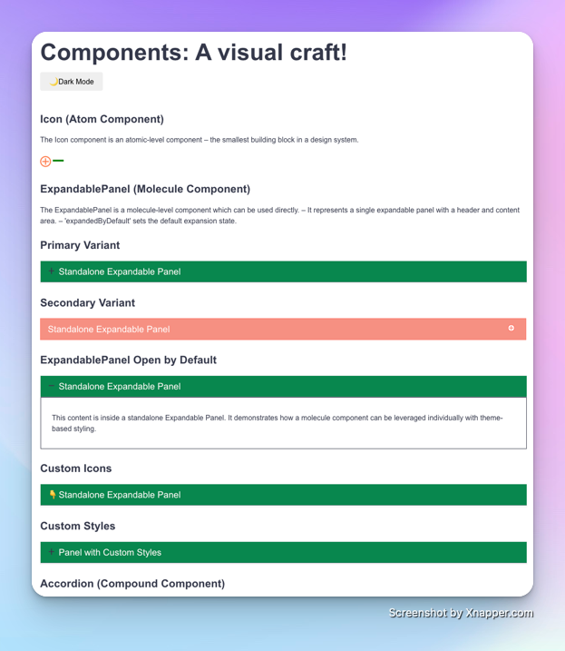
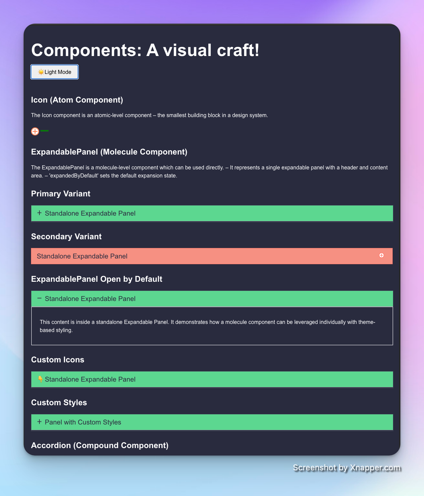

# Component Library Client Application

This repository contains a Client application showcasing the `@shubham_chauhan/component-lib` component library. The application demonstrates the usage of various components with different configurations, variants, and theming capabilities.

## ✨ Features

**Atomic Design Methodology**: Demonstrates how component-lib components (atom, molecule, and organism) work together to build UIs.

**Theming Support**: Toggle between light and dark themes with a single click.

**Responsive Design**: Shows how component-lib components adapt to different screen sizes.

**Accessibility**: Shows how component-lib components are designed with accessibility in mind.

**Customization**: Shows how component-lib components can be customized through props.

## 🚀 Getting Started

### Prerequisites

- Node.js (v16.0.0 or higher)
- npm (v8.0.0 or higher) or yarn (v1.22.0 or higher)

### Installation

1. Clone the repository:

```bash
git clone https://github.com/shubhamchauhan4488/component-lib.git
cd component-lib/client-app
```

## 🚀 Installation

Install dependencies:

```
npm install
```

## 💻 Running the Application

Build the app

```
npm run build
```

Start the development server:

```
npm run dev
```

The application will be available at [http://localhost:5173](http://localhost:5173).

## 🧩 Component Showcase

The client application showcases the following components:

### Icon (Atom Component)

The **Icon** component is an atomic-level component, the smallest building block in a design system. It accepts props such as `<span>name</span>`, `<span>size</span>`, `<span>strokeColor</span>`, and `<span>fill</span>` for customization.

### ExpandablePanel (Molecule Component)

The **ExpandablePanel** is a molecule-level component representing a single expandable panel with a header and content area.

* **Primary Variant**: Default styling
* **Secondary Variant**: Alternative styling
* **Open by Default**: Panel starts in expanded state
* **Custom Icons**: Demonstrates custom expand/collapse icons
* **Custom Styles**: Override default styling

### Accordion (Compound Component)

The **Accordion** component is a compound component that organizes multiple ExpandablePanels. It manages the state and behavior for a collection of "Expandable Panels."

* **Primary Variant**: Standard accordion with default styling
* **Secondary Variant**: Alternative styling for the accordion
* **Multiple Panel Open**: Configuration allowing multiple panels open simultaneously

## 🎨 Theming

The application demonstrates a theme-switching mechanism between **light** and **dark** themes. The theme context is provided by `<span>AppThemeContext</span>` and can be accessed throughout the application.

* **Toggle Themes**: Click the theme toggle button at the top of the page.

☀️ Light Mode

Dark Theme

🌙 Dark Mode 🫠


## 📁 Project Structure

```
client-app/
├── public/              # Static assets
├── src/
│   ├── App.jsx          # Main application component
│   ├── App.css          # Application styles
│   ├── AppContext.jsx   # Theme context provider
│   ├── index.css        # Global styles
│   └── main.jsx         # Application entry point
├── index.html           # HTML template
├── package.json         # Project dependencies and scripts
├── vite.config.js       # Vite configuration
└── README.md            # Project documentation
```
