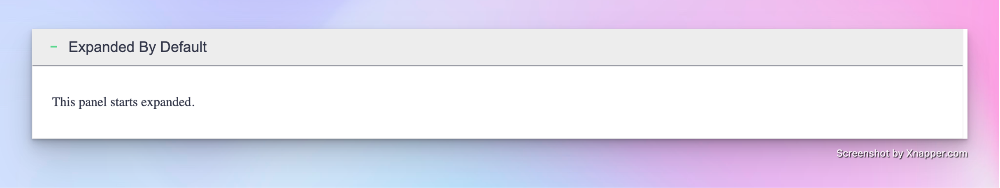
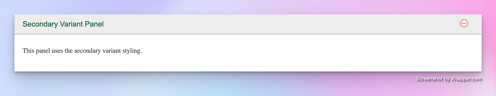
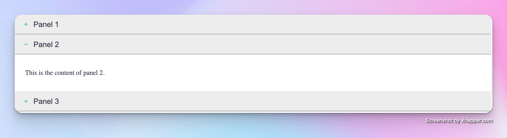
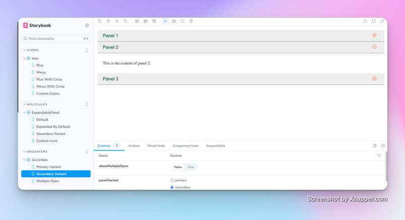
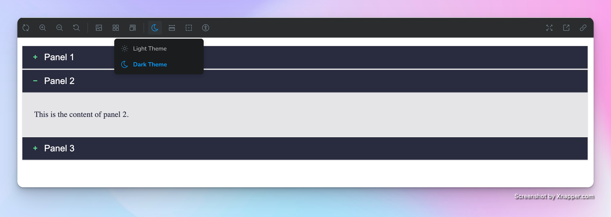

# 🚀 React Component Library: Building Blocks for Awesome UIs!

**Behold! A delightfully crafted, accessible, and customizable React Component Library built with Vite, TypeScript, and Storybook.**

---

## ✨ See it in action! 👉 [Play with our Storybook](https://67e03155d6ee9e0a477dad36-lmywntygig.chromatic.com/)

## 🎨 What makes this library awesome?

- **Atomic Design Magic**: Bringing a science concept to reality - atoms. See how tiny atom transform into molecules and then into full-blown organisms to create UI masterpieces!
- **Theme Switching Superpowers**: Flip between light and dark themes with a single click. Like magic!
- **Responsive Goodness**: Components that adapt faster than a chameleon.
- **Accessibility Champion**: Because everyone deserves a great user experience, no exceptions!
- **Customization Paradise**: Tweak and tune to make these components truly yours.
- **TypeScript + React**: Typings that makes your IDE happy and your bugs sad.
- **Vite-powered**: Lightning-fast builds.
- **Styled Components**: Scoped CSS-in-JS.
- **Storybook Wonderland**: An interactive playground where components come to life.
- **Testing Confidence**: Some tests that let you sleep peacefully at night.

## 📚 Component Hierarchy (It's Like a UI Family Tree!)

We've embraced the **Atomic Design Principle** - it's not just a methodology, it's a way of life:

* **Atoms** (basic building blocks of UI)

  * Funky SVG icons that bring personality to UI!

    
    
    
    
* **Molecules** (groupings of atoms)

  * Expandable content sections that provide interactive visibility control with various styling options and custom icons.
    
    
* **Organisms** (The Ultimate Team-up)

  * Grouped Expandable Panels that provide advanced keyboard navigation, accessibility features, and customizable expand/collapse behaviors.
    
    

## 🌈 Storybook - Where Components Come to Party!

Dive into our interactive Storybook wonderland:

👉 [Explore the Storybook Universe](https://67e03155d6ee9e0a477dad36-lmywntygig.chromatic.com/)



### Plot twist: We have themes!

Don't forget to toggle between themes


## 🚀 Getting Started in 3... 2... 1...

### What you'll need:

- Node.js (v16.0.0+) - Not your grandma's JavaScript!
- npm (v8.0.0+) or yarn (v1.22.0+) - Package management with personality!

### Installation (Let's Do This!)

Clone, navigate, dominate:

```bash
git clone https://github.com/shubhamchauhan4488/component-lib.git
cd component-lib/lib
npm install
```

# Magic Commands at your disposal

## Build Storybook static files

```bash
npm run build-storybook
```

## Run Storybook

```bash
npm run storybook
```

## Build the component library

```bash
npm run build
```

## Run tests

```bash
npm run test
```

## Run tests in watch mode

```bash
npm run test:watch
```

## Run tests with coverage

```bash
npm run test:coverage
```

## Preview built components

```bash
npm run preview
```

## 📦 Add Some Spice to Your Project!

Install our delightful package:

```bash
npm install @shubham_chauhan/component-lib
```

Import and use components (it's simple):

```js
import { Accordion, ExpandablePanel, Icon } from '@shubham_chauhan/component-lib';

const MyComponent = () => (
  <Accordion
    allowMultipleOpen={true}
    panelVariant="PRIMARY"
    items={[{
      id: 'example-panel',
      title: 'Example Panel',
      content: `<div>`Example content goes here.`</div>`,
    }]}
  />
);
```

Cherry-pick components if you're feeling selective:

```js
import { Accordion } from '@shubham_chauhan/component-lib/components/accordion';

const MyComponent = () => (
  <Accordion
    allowMultipleOpen={true}
    panelVariant="PRIMARY"
    items={[{
      id: 'example-panel',
      title: 'Example Panel',
      content: `<div>`Example content goes here.`</div>`,
    }]}
  />
);
```

## 📖 For more inspiration

Visit our Storybook playground 👉 [Storybook Wonderland](https://67e03155d6ee9e0a477dad36-lmywntygig.chromatic.com/) for interactive examples that will make you say "Wow, I need this in my project!"
